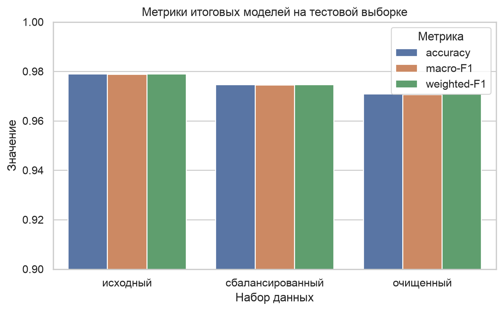
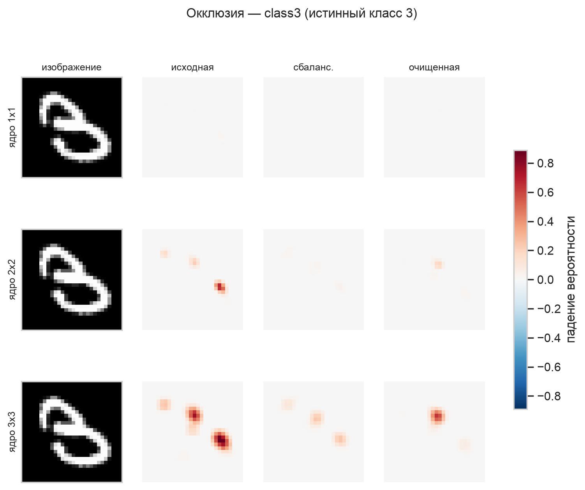
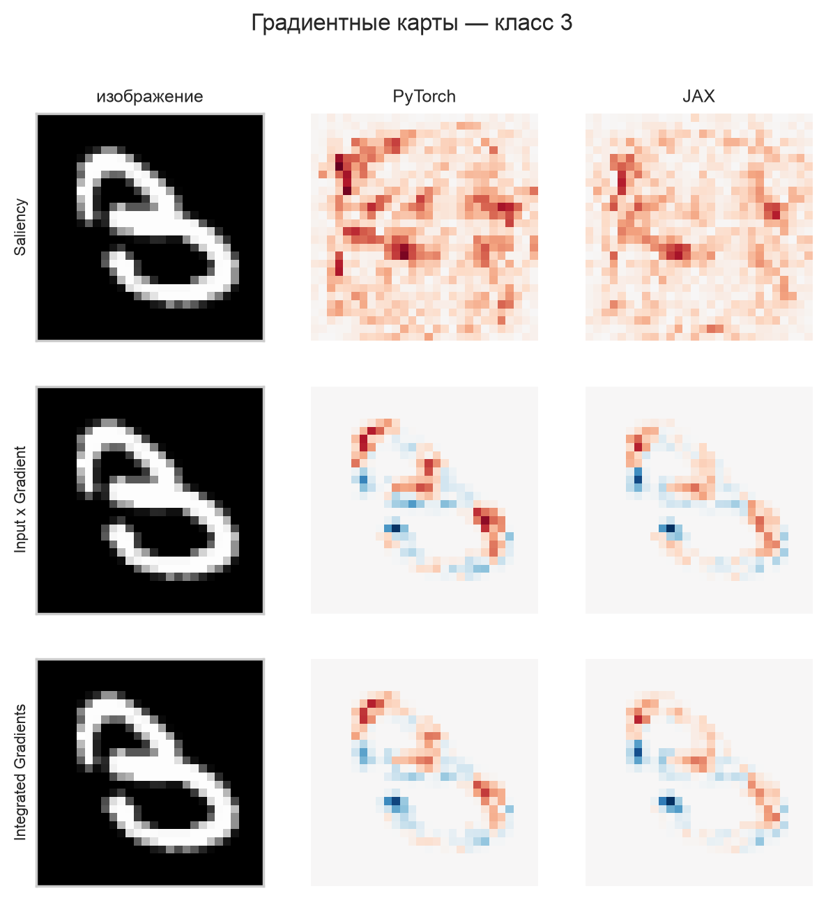

# mnist-mlp-validation

[](https://github.com/PolinaKirillovna/mnist-mlp-validation/actions/workflows/ci.yml)
[](LICENSE)

Data validation, two-layer perceptron training in **PyTorch and JAX**, and model
interpretation (occlusion, first-layer weight maps, gradient-based saliency) on an
MNIST subset. The project follows a clean, layered `src`-layout package.

> Educational project for the ITMO course *AI Systems Validation* (laboratory
> practicum). Report and notebook are in Russian; code and docs are in English.

## What is done

- **Part 1 — data investigation.** Quality checks (duplicates, label conflicts,
  out-of-range, empty/full, intensity/centroid/kNN/Isolation-Forest outliers) on the
  60k-row variant V3: found 3 866 full-row duplicates (all in class 3), 0 label
  conflicts, ~2.35% anomalies; class imbalance ratio 4.80; PCA/t-SNE/UMAP projections;
  quantitative (`n = t²pq/Δ²`) and qualitative representativeness; balanced & cleaned sets.
- **Part 2 — training.** Two-layer MLP (784→256→128→10, 235 146 params) over the grid
  {original, balanced, cleaned} × dropout {0, 0.2, 0.5} × {relu, tanh, gelu} — 27 runs;
  best model per dataset selected by validation macro-F1.
- **Part 3 — interpretation.** Error/confidence galleries, most-confused pairs,
  model disagreement (3.2%), behaviour on saved anomalies, occlusion maps (1×1/2×2/3×3)
  and first-layer weight/activation maps.
- **Part 4 — PyTorch vs JAX + gradients.** The three configs re-trained in JAX; matched
  conditions and shared batch order; stability over 3 seeds; Saliency / Input×Gradient /
  Integrated Gradients in both frameworks.

### Key results

Test set: shared `mnist_test.csv` (10 000 images). Best config per dataset.

| Dataset variant | Config | PyTorch macro-F1 | JAX macro-F1 |
|---|---|---:|---:|
| original (54k, imbalanced) | tanh, p=0.0 | 0.979 | 0.982 |
| balanced (18.75k) | gelu, p=0.5 | 0.975 | 0.975 |
| cleaned (18.39k) | gelu, p=0.5 | 0.971 | 0.969 |

PyTorch and JAX agree on 98.4–98.6% of predictions; saliency maps correlate 0.68–0.81
across frameworks. Selected figures:

| | |
|---|---|
|  |  |
|  |  |

## Repository structure

```
src/mnist_validation/   # package: config, data, models, training, evaluation, interpretation, visualization, cli
configs/                # YAML experiment configs (base, grid, smoke)
tests/                  # fast unit tests on synthetic arrays
notebooks/              # final executed notebook
reports/                # report.md, figures/, tables/
docs/                   # data source, representation, theory, control questions
data/                   # raw/ (not tracked), processed/, anomalies/
```

## Installation

```bash
conda env create -f environment.yml   # or reuse an existing python 3.12 env
conda activate ai-validation
pip install -e ".[dev]"
make data                             # copies the variant CSVs into data/raw/
```

## Reproduce

```bash
make lint test        # quality gate
make validate         # Part 1: data validation, figures, tables
make grid             # Part 2: training grid
make interpret        # Part 3: interpretation
make jax              # Part 4: JAX runs + comparison
make smoke            # fast end-to-end check (2 epochs, subsample)
```

Device selection is automatic for PyTorch (`mps` → `cuda` → `cpu`); JAX runs on CPU.

Timing (reference: Intel MacBook, CPU): `make validate` ≈ 3 min, the 27-run
`make grid` ≈ 19 min, `make interpret` ≈ 1 min, `make jax` (18 runs + gradients)
≈ 13 min. `make smoke` runs the whole pipeline on a tiny grid in under a minute.

> Note: on Intel macOS the last available PyTorch wheel is 2.2.2, which requires
> `numpy<2`; the whole scientific stack is pinned accordingly in `pyproject.toml`.

## Report and notebook

- Report: [`reports/report.md`](reports/report.md) (build `reports/report.docx` with `make report`)
- Notebook: [`notebooks/lab1_mnist_validation.ipynb`](notebooks/lab1_mnist_validation.ipynb)

## Source

Task based on: Попов И.Ю., Бучаев А.Я., Есипов Д.А. *Валидация систем искусственного
интеллекта: Лабораторный практикум.* — СПб: Университет ИТМО, 2024. — 36 с.
