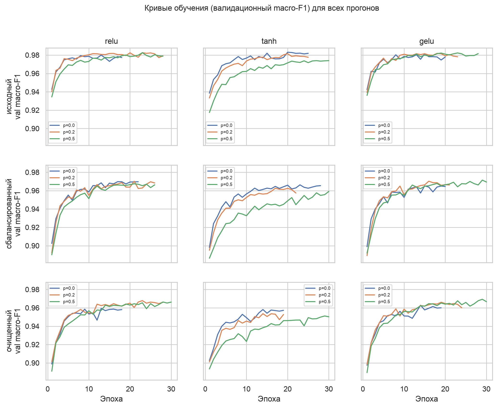
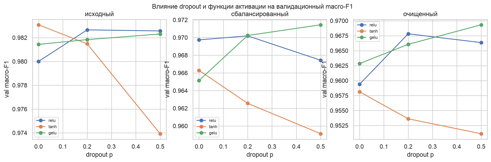
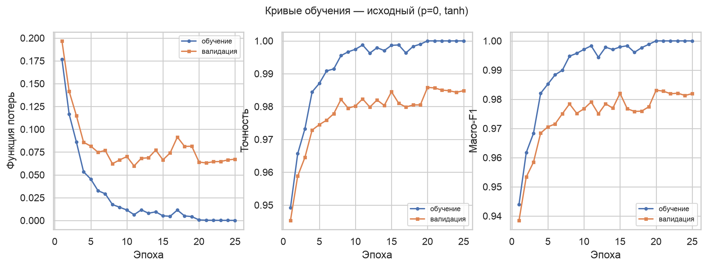
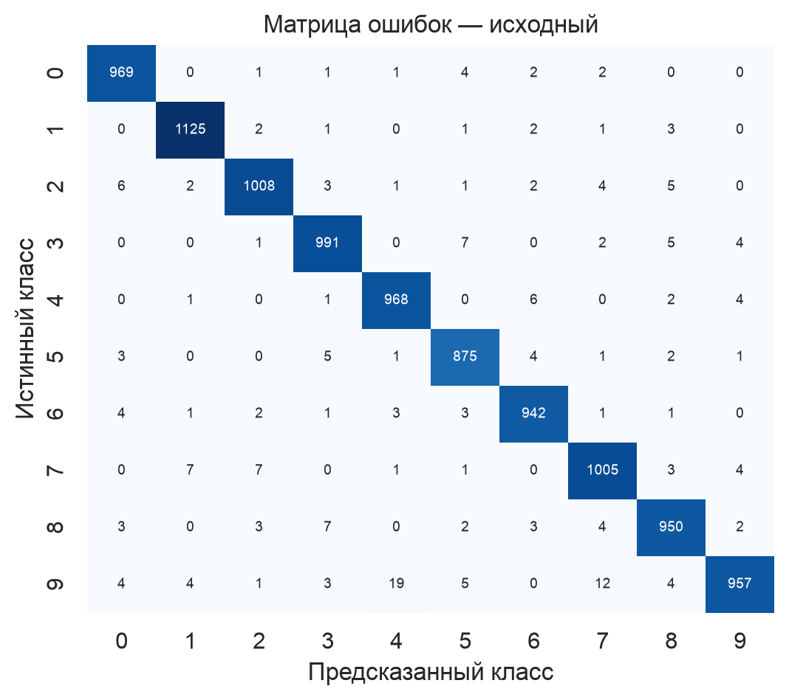
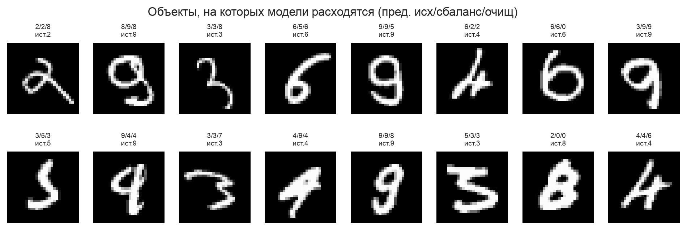
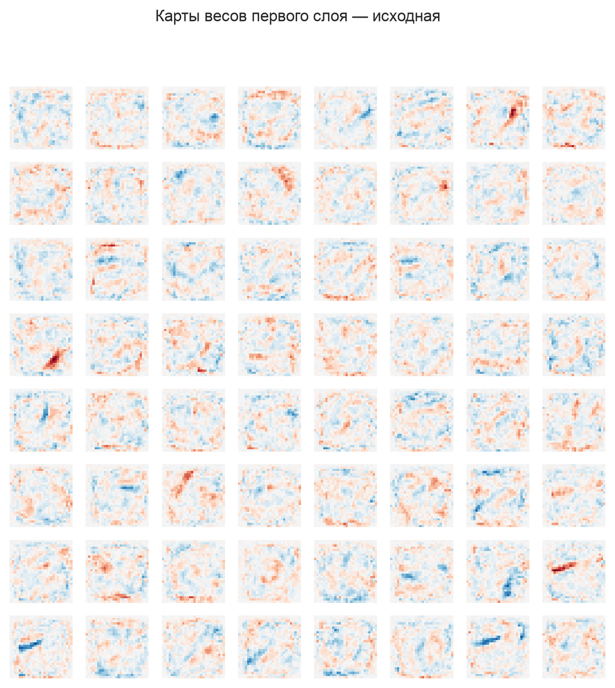

# Титульный лист {.unnumbered}

**Университет ИТМО**

Дисциплина: «Валидация систем искусственного интеллекта»

Тема: «Валидация данных, обучение и интерпретация модели классификации
изображений MNIST»

Выполнил(-а): магистрант гр. M4145 Деревицкая Полина Кирилловна

Проверил(-а): Доцент ФБИТ, к.т.н. Попов И. Ю.

Санкт-Петербург, 2025

\newpage

# Цель работы и используемые инструменты

**Цель работы** — получить практические навыки исследования и валидации
обучающего набора данных, построения и обучения нейронной сети для
классификации изображений, оценки качества модели, а также количественной и
качественной интерпретации её предсказаний.

**Задачи:**

1. Описать структуру исходного набора данных и выбранное представление
   изображений, указать его ограничения.
2. Выполнить проверку качества данных, найти и сохранить аномальные объекты.
3. Оценить дисбаланс классов и репрезентативность выборки (качественно и
   количественно).
4. Подготовить сбалансированный и очищенный варианты обучающего набора.
5. Реализовать и обучить двухслойный перцептрон, исследовать влияние dropout и
   функции активации на разных вариантах данных.
6. Количественно и качественно оценить предсказания трёх итоговых моделей,
   построить карты чувствительности (окклюзия) и карты весов первого слоя.
7. Дополнительно: реализовать модель на PyTorch и JAX, сравнить фреймворки и
   применить градиентные методы анализа чувствительности.

**Инструменты:** Python 3.12; NumPy, pandas, scikit-learn, UMAP для анализа
данных; PyTorch и JAX (Flax, Optax) для моделей; matplotlib и seaborn для
визуализации. Код оформлен как пакет `mnist_validation` (архитектура с
разделением на слои), покрыт юнит-тестами и проверками `ruff`/`mypy`.

\newpage

# Описание исходных данных и результаты data investigation

## Структура набора

Используется **вариант V3** подвыборки MNIST, выданной преподавателем. Обучающий
файл `d3.csv` содержит 60 000 строк, тестовый `mnist_test.csv` — 10 000 строк.
Формат подтверждён кодом (`python -m mnist_validation check-data`): столбец
`label` и 784 столбца пикселей `1x1` … `28x28` (значения 0–255, тип `uint8`),
пропусков нет. Тестовая выборка стандартная, сбалансированная (~1000 объектов на
класс) и используется как **единая** для всех экспериментов.

Примеры изображений по классам приведены на рисунке 1.

## Распределение по классам и дисбаланс

Распределение объектов по классам сильно неравномерно (рисунок 2, таблица 1):
класс 3 раздут до 9 997 объектов, класс 9 урезан до 2 083. Коэффициент
дисбаланса (max/min) равен **4,80**, нормированная энтропия распределения —
**0,979** (1,0 соответствует равномерному распределению).

Таблица 1 – Число объектов по классам (обучающий набор)

| Класс | 0 | 1 | 2 | 3 | 4 | 5 | 6 | 7 | 8 | 9 |
|---|---:|---:|---:|---:|---:|---:|---:|---:|---:|---:|
| Объектов | 5923 | 6742 | 5958 | 9997 | 5842 | 5421 | 5918 | 6265 | 5851 | 2083 |

## Проверка качества данных и поиск аномалий

Проверки реализованы в модуле `data/quality.py`; каждая возвращает структурный
результат с индексами строк и причиной. Итоги приведены в таблице 2.

Таблица 2 – Результаты проверок качества (обучающий набор, 60 000 объектов)

| Проверка | Найдено | Доля |
|---|---:|---:|
| Полные дубликаты строк | 3866 | 6,44 % |
| Дубликаты изображений с той же меткой | 3866 | 6,44 % |
| Конфликты меток (одно изображение — разные метки) | 0 | 0 % |
| Значения вне диапазона [0, 255] | 0 | 0 % |
| Почти пустые изображения | 0 | 0 % |
| Почти полностью заполненные | 0 | 0 % |
| Выброс по статистике интенсивности | 462 | 0,77 % |
| Далеко от центроида класса | 461 | 0,77 % |
| Выброс по kNN-расстоянию (PCA) | 300 | 0,50 % |
| Выброс (Isolation Forest, PCA) | 600 | 1,00 % |
| **Аномалии (объединение, уникальные строки)** | **1409** | **2,35 %** |

Ключевые наблюдения:

- **Дубликаты сосредоточены в классе 3**: все 3 866 полных дубликатов строк
  относятся к классу 3, что и объясняет его раздувание. Повторов изображения с
  *другой* меткой нет (число дубликатов изображений без учёта метки совпадает с
  числом полных дубликатов строк), конфликтов меток — 0.
- **Пустых/переполненных изображений нет**: цифры MNIST всегда активируют более
  2 % пикселей, поэтому пороги заполненности (`empty_active_fraction = 0,02`,
  `filled_active_fraction = 0,95`) не срабатывают. Пороги обоснованы тем, что
  типичная цифра активирует 10–25 % пикселей (таблица 3).
- **Статистические выбросы** ищутся по средней интенсивности, дисперсии, числу и
  доле ненулевых пикселей, сумме интенсивностей (z-оценка внутри класса,
  порог 3σ), по расстоянию до центроида класса, а также в пространстве PCA
  (kNN-расстояние и Isolation Forest). Итоговая доля аномалий — **2,35 %**.

Все аномальные объекты сохранены отдельно в `data/anomalies/anomalies.parquet`
(изображение, исходная метка, идентификатор строки, список причин) и используются
в Части 3. Примеры дубликатов и аномалий с подписанными причинами приведены на
рисунках 3 и 4.

Таблица 3 – Средние статистики яркости и заполненности по классам (фрагмент)

| Класс | Средняя интенсивность | Доля активных пикселей |
|---|---:|---:|
| 0 | 44,2 | 0,245 |
| 1 | 19,4 | 0,109 |
| 3 | 36,1 | 0,208 |
| 7 | 29,2 | 0,168 |
| 8 | 38,3 | 0,221 |

Распределения средней интенсивности и заполненности по классам приведены на
рисунках 5 и 6 (класс 1 ожидаемо самый «тонкий», класс 0 — самый «плотный»).

## Понижение размерности

PCA, t-SNE и UMAP построены на одной стратифицированной подвыборке (~10 000
объектов); аномалии и дубликаты выделены отдельными маркерами (рисунки 7–9).
PCA (две компоненты) даёт сильное перекрытие классов; t-SNE и UMAP разделяют
классы в кластеры. Для качественного анализа аномалий выбран **UMAP** (быстрый,
воспроизводимый, сохраняет и локальную, и глобальную структуру); обоснование — в
`docs/dim_reduction.md`.

## Оценка репрезентативности

**Количественная.** По формуле $n = t^2 p q / \Delta^2$ (t = 1,96, Δ = 0,05,
p — доля класса) вычислено необходимое число объектов для каждого класса и
сопоставлено с фактическим (таблица 4). Даже для самого малого класса 9
требуется всего ~51 объект, тогда как фактически их 2 083 — то есть по объёму
**все классы репрезентативны** с запасом.

Таблица 4 – Количественная репрезентативность по классам

| Класс | Доля | Требуется $n$ | Фактически | Достаточно |
|---|---:|---:|---:|:--:|
| 0 | 0,0987 | 137 | 5923 | да |
| 3 | 0,1666 | 213 | 9997 | да |
| 9 | 0,0347 | 51 | 2083 | да |

**Качественная.** Распределение классов далеко от равномерного (коэффициент
дисбаланса 4,80). Хотя объёма достаточно, дисбаланс и дубликаты класса 3 могут
смещать модель в сторону преобладающего класса и завышать оценки на нём —
поэтому необходимы балансировка и очистка.

**Вывод по репрезентативности.** Набор репрезентативен количественно (объёма
хватает для всех классов), но качественно проблематичен: сильный дисбаланс
(классы 3 и 9), значительная доля дубликатов в классе 3 и ~2,35 % аномальных
объектов. Утечки тестовой выборки в обучающую нет: пересечение по точным
дубликатам изображений test↔train равно **0**.

# Описание представления изображений и его недостатков

Изображение 28 × 28 разворачивается в вектор длины 784 (row-major):
пиксель (r, c) → позиция $i = 28r + c$. Преобразование обратимо и не теряет
яркостную информацию, но для **полносвязной** сети теряется пространственная
структура: соседство пикселей, локальность признаков и инвариантность к сдвигу
модель должна выучивать из данных. Перед подачей значения масштабируются в
[0, 1] (деление на 255), что важно для интерпретации знаков весов первого слоя
(Часть 3). Подробно — в `docs/representation.md`, ответ на вопрос № 1 — в
`docs/control_questions.md`.

# Методики балансировки и фильтрации аномалий

Из обучающего набора сначала выделяется валидационная выборка (стратифицированное
разбиение 90/10, фиксированный seed), балансировка и очистка применяются **только
к обучающей части**, валидация остаётся исходной (чтобы отбор модели шёл по
реалистичному распределению). Строятся три варианта обучающего набора:

- **original** — обучающая часть без изменений (54 000 объектов);
- **balanced** — undersampling каждого класса до размера наименьшего класса
  (1 875 объектов на класс, всего 18 750);
- **cleaned** — сначала удаляются дубликаты и аномалии, затем undersampling
  (1 839 объектов на класс, всего 18 390).

Undersampling выбран потому, что класс 9 (после разбиения ~1 875 объектов) —
узкое место, а oversampling дублировал бы и без того малочисленный класс.
Аномалии не отбрасываются безвозвратно, а сохраняются для Части 3. Сравнение
распределений и размеров наборов — на рисунках 10 и 11.

# Описание архитектуры и параметров обучения

**Архитектура.** Реализован двухслойный перцептрон — два обучаемых скрытых слоя
и выходной слой. Термин «двухслойный» в задании неоднозначен, поэтому трактовка
зафиксирована явно: два скрытых полносвязных слоя размерами 256 и 128 нейронов.
Схема: вход 784 → Linear(784, 256) → активация → Dropout → Linear(256, 128) →
активация → Dropout → Linear(128, 10) → логиты. Размерности тензоров и число
параметров приведены в таблице 5.

Таблица 5 – Размерности и число обучаемых параметров

| Слой | Форма входа | Форма выхода | Параметры (формула) | Параметров |
|---|---|---|---|---:|
| Linear 1 | (N, 784) | (N, 256) | 784·256 + 256 | 200 960 |
| Linear 2 | (N, 256) | (N, 128) | 256·128 + 128 | 32 896 |
| Linear 3 (выход) | (N, 128) | (N, 10) | 128·10 + 10 | 1 290 |
| **Итого** | | | | **235 146** |

**Softmax.** Модель выдаёт **логиты**; softmax в модель не входит. При обучении
логиты подаются в функцию потерь (`nn.CrossEntropyLoss` в PyTorch,
`optax.softmax_cross_entropy_with_integer_labels` в JAX), которая применяет
log-softmax внутри. Вероятности классов при выводе получаются отдельным вызовом
softmax к логитам.

**Разбиение.** Тестовая выборка задана отдельно (`mnist_test.csv`, 10 000
объектов) и одна и та же для всех экспериментов. Обучающий вариант делится
стратифицированно 90/10 на обучающую и валидационную части (фиксированный seed);
балансировка и очистка применяются только к обучающей части. Размеры: original —
54 000, balanced — 18 750, cleaned — 18 390; валидация — 6 000; тест — 10 000.

**Параметры обучения** (единые для всех прогонов): оптимизатор AdamW,
скорость обучения 1·10⁻³, L2-регуляризация (weight decay) 1·10⁻⁴, размер пакета
128, до 30 эпох, ранняя остановка по валидационному macro-F1 с терпением 5 эпох
(сохраняется лучший чекпоинт), функция потерь — кросс-энтропия. Нормализация
входа — деление на 255 (масштаб [0, 1]). Порядок мини-пакетов задаётся общей
seed-перестановкой NumPy (используется и в PyTorch, и в JAX).

# Результаты обучения экземпляров модели с разными dropout и функциями активации

Проведена полная сетка экспериментов: наборы {original, balanced, cleaned} ×
dropout p ∈ {0,0; 0,2; 0,5} × активации {relu, tanh, gelu} — 27 прогонов PyTorch
(сводка в `reports/tables/part2_grid.csv`). Кривые обучения всех прогонов
(валидационный macro-F1) приведены на рисунке 12, влияние dropout и активации —
на рисунке 13.

Для каждого набора выбрана лучшая по валидационному macro-F1 конфигурация — так
получены **три итоговые модели** (таблица 6):

Таблица 6 – Выбранные конфигурации итоговых моделей

| Набор | Активация | Dropout p | Обоснование выбора |
|---|---|---|---|
| original | tanh | 0,0 | Максимальный val macro-F1; большой набор не требует сильной регуляризации |
| balanced | gelu | 0,5 | На меньшем наборе dropout 0,5 заметно снижает переобучение |
| cleaned | gelu | 0,5 | Аналогично balanced; удаление аномалий не меняет выбор |

Наблюдения по графикам: на большом наборе original кривые обучения и валидации
идут близко — признак устойчивого обучения без выраженного переобучения, поэтому
лучшей оказывается конфигурация без dropout. На меньших наборах balanced и
cleaned без dropout появляется разрыв train/val (переобучение), и dropout 0,5 его
сокращает. Недообучения (низкие метрики и на train, и на val) не наблюдается ни в
одном прогоне. Кривые обучения и матрица ошибок модели original приведены на
рисунках 14–15, сравнение метрик — на рисунке 16.

# Количественное сравнение моделей

Итоговые метрики трёх моделей на единой тестовой выборке приведены в таблице 7
(полный набор — accuracy, macro/weighted precision/recall/F1, число и доля ошибок,
средняя уверенность — в `reports/tables/part2_final_metrics.csv`).

Таблица 7 – Итоговые метрики моделей на тесте (10 000 объектов)

| Набор | Accuracy | Macro-F1 | Weighted-F1 | Ошибок | Ср. увер. (верно) | Ср. увер. (ошибка) |
|---|---:|---:|---:|---:|---:|---:|
| original | 0,9790 | 0,9788 | 0,9790 | 210 | 0,995 | 0,812 |
| balanced | 0,9747 | 0,9745 | 0,9747 | 253 | 0,991 | 0,821 |
| cleaned | 0,9709 | 0,9707 | 0,9709 | 291 | 0,993 | 0,797 |

Выводы по сравнению:

- Наивысшее качество у модели **original**: несмотря на дисбаланс, больший объём
  обучающих данных (54 000 против ~18 000) перевешивает выигрыш от балансировки
  на этой простой архитектуре и «чистом» MNIST. Macro-F1 (учитывающий редкие
  классы) у original также максимален — то есть дисбаланс здесь не приводит к
  провалу на малочисленных классах.
- Балансировка и очистка **сокращают** обучающую выборку втрое, что немного
  снижает метрики (macro-F1 0,975 и 0,971). При этом на меньших наборах
  оптимальным становится dropout 0,5 — регуляризация компенсирует меньший объём.
- Во всех моделях средняя уверенность на верных предсказаниях (~0,99) заметно
  выше, чем на ошибочных (~0,80–0,82): модель «сомневается» именно там, где
  ошибается.
- Полное число обучаемых параметров — 235 146 (таблица 5).

# Качественный анализ предсказаний и аномальных объектов

Для каждой из трёх моделей построены галереи характерных примеров: верно
классифицированные с высокой и с низкой уверенностью, ошибочные с высокой и с
низкой уверенностью (`reports/figures/part3_examples_*.png`). Наиболее часто
путаемые пары классов (топ-5 из матрицы ошибок модели original): 9→4 (19 случаев),
9→7 (12), 3→5 (7), 7→1 (7), 7→2 (7) — это типичные для MNIST смешения похожих по
начертанию цифр. Полный список — в `reports/tables/part3_confused_pairs.csv`.

Объектов, на которых предсказания трёх моделей расходятся, — **318** (3,18 % теста,
рисунок 17). Это преимущественно нечёткие или нетипично написанные цифры, то есть
пограничные объекты, где выбор набора данных влияет на решение.

**Поведение на аномальных объектах.** Все 1 409 сохранённых аномалий поданы во все
три модели (`reports/tables/part3_anomaly_behavior.csv`). В среднем с исходной
меткой согласуются 2,74 из 3 моделей, а средняя уверенность модели original на
аномалиях составляет 0,995. Лишь для 8 аномалий ни одна модель не воспроизводит
исходную метку. Вывод: выявленные «аномалии» — это статистические выбросы по
интенсивности/заполненности и объекты на периферии кластеров в пространстве PCA, но
в большинстве это по-прежнему читаемые цифры, которые модели уверенно и, как
правило, верно классифицируют. Это объясняет, почему удаление аномалий при очистке
почти не улучшает метрики: они не являются грубо ошибочными объектами.

# Тепловые карты чувствительности (окклюзия 1×1, 2×2, 3×3)

Реализован метод последовательного закрашивания (окклюзии): окно размера 1×1, 2×2
или 3×3 со сдвигом 1 последовательно заменяет область изображения фоновым
значением (0 после нормализации), после каждой модификации модель пересчитывает
предсказание. Для каждой позиции фиксируется падение вероятности исходно
предсказанного (и истинного) класса. Правило отображения окна на пиксели:
скалярное падение накапливается в буфер 28×28 по всем покрытым окном пикселям
вместе со счётчиком покрытий, итоговая карта — поэлементное среднее (буфер/счётчик).
Все модификации одного изображения прогоняются одним батчем. Для сопоставимости
трёх моделей на одном изображении используется единая цветовая шкала.

Карты построены для по одному репрезентативному изображению каждого класса, а
также для ошибочных и аномальных объектов
(`reports/figures/part3_occlusion_*.png`). Пример для цифры 3 приведён на
рисунке 18. Наибольшее падение вероятности сосредоточено на штрихах, формирующих
цифру (для 3 — правые дуги), что подтверждает: модель опирается на осмысленные
области. С ростом размера ядра карты становятся «глаже» и контрастнее (закрытие
большей области сильнее меняет ответ).

# Карты весов и активаций нейронов первого слоя

Для каждой модели веса каждого нейрона первого слоя (вектор длины 784)
преобразованы в матрицу 28×28 и показаны диверго­нирующей цветовой шкалой,
симметричной относительно нуля (рисунок 19). Поскольку вход неотрицателен
(масштаб [0, 1]), положительные веса (красные) усиливают отклик нейрона там, где
пиксель активен, отрицательные (синие) — подавляют. Многие нейроны формируют
локальные детекторы штрихов и дуг. У моделей, обученных с dropout 0,5 (balanced,
cleaned), карты весов визуально менее «зашумлены», чем у модели original без
dropout, — регуляризация сглаживает веса (связь с ЛР4 методички).

Дополнительно построены тепловые карты средней активации нейронов первого слоя по
классам (H×10, `reports/figures/part3_activation_*.png`): видно, что отдельные
нейроны специализируются на конкретных классах (сильная активация в одном
столбце), что указывает на формирование классоспецифичных признаков уже на первом
слое.

# Сравнительный анализ PyTorch и JAX, дополнительный метод анализа

*Раздел будет дополнен на этапе дополнительного задания (Часть 4).*

# Итоговая сводка и выводы

*Раздел будет дополнен после завершения всех частей.*

# Список литературы

1. Попов И. Ю., Бучаев А. Я., Есипов Д. А. Валидация систем искусственного
   интеллекта: Лабораторный практикум. — СПб: Университет ИТМО, 2024. — 36 с.
2. ГОСТ 7.32–2017. Отчёт о научно-исследовательской работе. Структура и правила
   оформления.
3. LeCun Y., Cortes C., Burges C. The MNIST database of handwritten digits.
