# Титульный лист {.unnumbered}

**Университет ИТМО**

Дисциплина: «Валидация систем искусственного интеллекта»

Тема: «Валидация данных, обучение и интерпретация модели классификации
изображений MNIST»

Выполнил(-а): магистрант гр. M4145 Деревицкая Полина Кирилловна

Проверил(-а): Доцент ФБИТ, к.т.н. Попов И. Ю.

Санкт-Петербург, 2025

\newpage

# Цель работы и используемые инструменты

**Цель работы** — получить практические навыки исследования и валидации
обучающего набора данных, построения и обучения нейронной сети для
классификации изображений, оценки качества модели, а также количественной и
качественной интерпретации её предсказаний.

**Задачи:**

1. Описать структуру исходного набора данных и выбранное представление
   изображений, указать его ограничения.
2. Выполнить проверку качества данных, найти и сохранить аномальные объекты.
3. Оценить дисбаланс классов и репрезентативность выборки (качественно и
   количественно).
4. Подготовить сбалансированный и очищенный варианты обучающего набора.
5. Реализовать и обучить двухслойный перцептрон, исследовать влияние dropout и
   функции активации на разных вариантах данных.
6. Количественно и качественно оценить предсказания трёх итоговых моделей,
   построить карты чувствительности (окклюзия) и карты весов первого слоя.
7. Дополнительно: реализовать модель на PyTorch и JAX, сравнить фреймворки и
   применить градиентные методы анализа чувствительности.

**Инструменты:** Python 3.12; NumPy, pandas, scikit-learn, UMAP для анализа
данных; PyTorch и JAX (Flax, Optax) для моделей; matplotlib и seaborn для
визуализации. Код оформлен как пакет `mnist_validation` (архитектура с
разделением на слои), покрыт юнит-тестами и проверками `ruff`/`mypy`.

\newpage

# Описание исходных данных и результаты data investigation

## Структура набора

Используется **вариант V3** подвыборки MNIST, выданной преподавателем. Обучающий
файл `d3.csv` содержит 60 000 строк, тестовый `mnist_test.csv` — 10 000 строк.
Формат подтверждён кодом (`python -m mnist_validation check-data`): столбец
`label` и 784 столбца пикселей `1x1` … `28x28` (значения 0–255, тип `uint8`),
пропусков нет. Тестовая выборка стандартная, сбалансированная (~1000 объектов на
класс) и используется как **единая** для всех экспериментов.

Примеры изображений по классам приведены на рисунке 1.

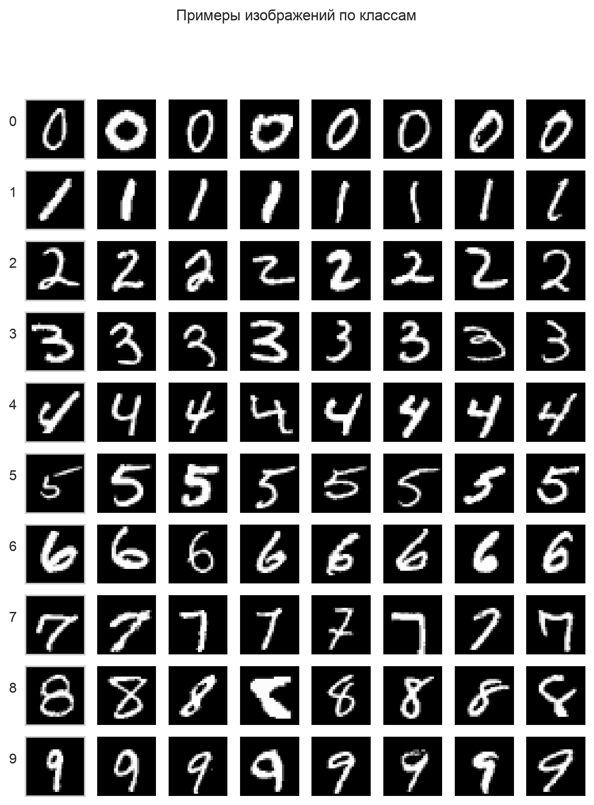

## Распределение по классам и дисбаланс

Распределение объектов по классам сильно неравномерно (рисунок 2, таблица 1):
класс 3 раздут до 9 997 объектов, класс 9 урезан до 2 083. Коэффициент
дисбаланса (max/min) равен **4,80**, нормированная энтропия распределения —
**0,979** (1,0 соответствует равномерному распределению).

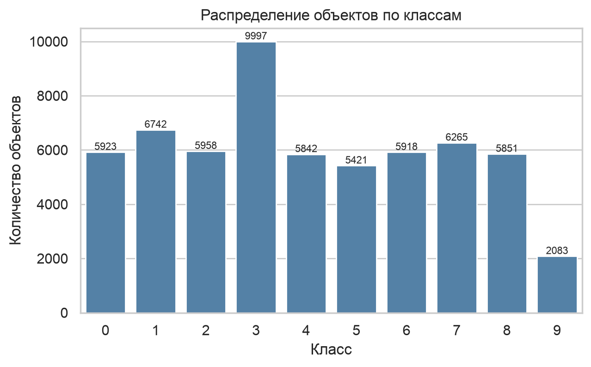

Таблица 1 – Число объектов по классам (обучающий набор)

| Класс | 0 | 1 | 2 | 3 | 4 | 5 | 6 | 7 | 8 | 9 |
|---|---:|---:|---:|---:|---:|---:|---:|---:|---:|---:|
| Объектов | 5923 | 6742 | 5958 | 9997 | 5842 | 5421 | 5918 | 6265 | 5851 | 2083 |

## Проверка качества данных и поиск аномалий

Проверки реализованы в модуле `data/quality.py`; каждая возвращает структурный
результат с индексами строк и причиной. Итоги приведены в таблице 2.

Таблица 2 – Результаты проверок качества (обучающий набор, 60 000 объектов)

| Проверка | Найдено | Доля |
|---|---:|---:|
| Полные дубликаты строк | 3866 | 6,44 % |
| Дубликаты изображений с той же меткой | 3866 | 6,44 % |
| Конфликты меток (одно изображение — разные метки) | 0 | 0 % |
| Значения вне диапазона [0, 255] | 0 | 0 % |
| Почти пустые изображения | 0 | 0 % |
| Почти полностью заполненные | 0 | 0 % |
| Выброс по статистике интенсивности | 462 | 0,77 % |
| Далеко от центроида класса | 461 | 0,77 % |
| Выброс по kNN-расстоянию (PCA) | 300 | 0,50 % |
| Выброс (Isolation Forest, PCA) | 600 | 1,00 % |
| **Аномалии (объединение, уникальные строки)** | **1409** | **2,35 %** |

Ключевые наблюдения:

- **Дубликаты сосредоточены в классе 3**: все 3 866 полных дубликатов строк
  относятся к классу 3, что и объясняет его раздувание. Повторов изображения с
  *другой* меткой нет (число дубликатов изображений без учёта метки совпадает с
  числом полных дубликатов строк), конфликтов меток — 0.
- **Пустых/переполненных изображений нет**: цифры MNIST всегда активируют более
  2 % пикселей, поэтому пороги заполненности (`empty_active_fraction = 0,02`,
  `filled_active_fraction = 0,95`) не срабатывают. Пороги обоснованы тем, что
  типичная цифра активирует 10–25 % пикселей (таблица 3).
- **Статистические выбросы** ищутся по средней интенсивности, дисперсии, числу и
  доле ненулевых пикселей, сумме интенсивностей (z-оценка внутри класса,
  порог 3σ), по расстоянию до центроида класса, а также в пространстве PCA
  (kNN-расстояние и Isolation Forest). Итоговая доля аномалий — **2,35 %**.

Все аномальные объекты сохранены отдельно в `data/anomalies/anomalies.parquet`
(изображение, исходная метка, идентификатор строки, список причин) и используются
в Части 3. Примеры дубликатов и аномалий с подписанными причинами приведены на
рисунках 3 и 4.

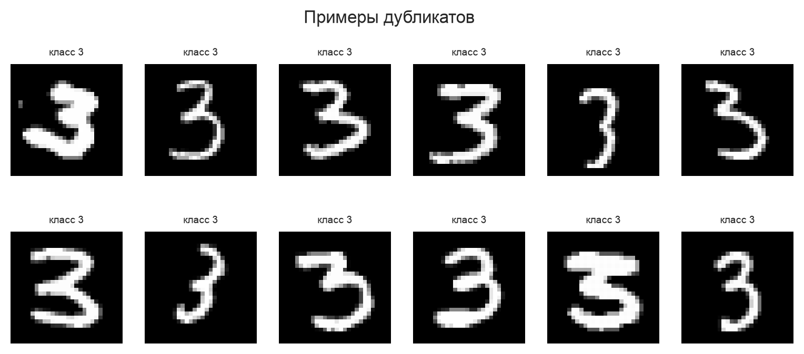

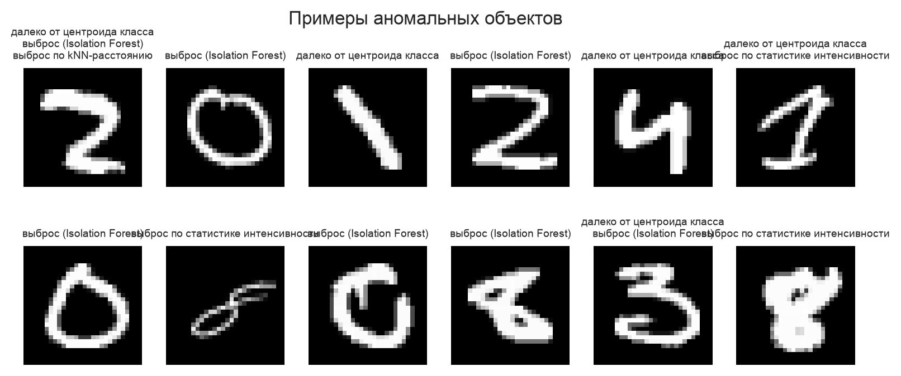

Таблица 3 – Средние статистики яркости и заполненности по классам (фрагмент)

| Класс | Средняя интенсивность | Доля активных пикселей |
|---|---:|---:|
| 0 | 44,2 | 0,245 |
| 1 | 19,4 | 0,109 |
| 3 | 36,1 | 0,208 |
| 7 | 29,2 | 0,168 |
| 8 | 38,3 | 0,221 |

Распределения средней интенсивности и заполненности по классам приведены на
рисунках 5 и 6 (класс 1 ожидаемо самый «тонкий», класс 0 — самый «плотный»).

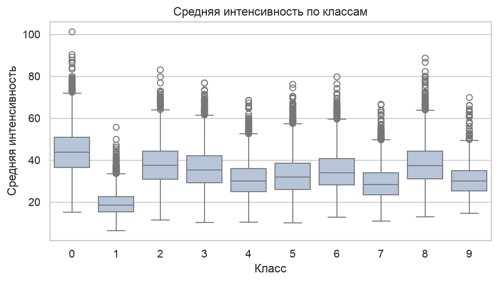

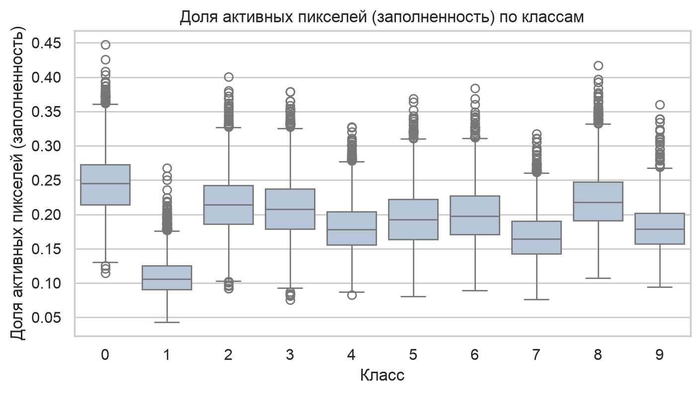

## Понижение размерности

PCA, t-SNE и UMAP построены на одной стратифицированной подвыборке (~10 000
объектов); аномалии и дубликаты выделены отдельными маркерами (рисунки 7–9).
PCA (две компоненты) даёт сильное перекрытие классов; t-SNE и UMAP разделяют
классы в кластеры. Для качественного анализа аномалий выбран **UMAP** (быстрый,
воспроизводимый, сохраняет и локальную, и глобальную структуру); обоснование — в
`docs/dim_reduction.md`.

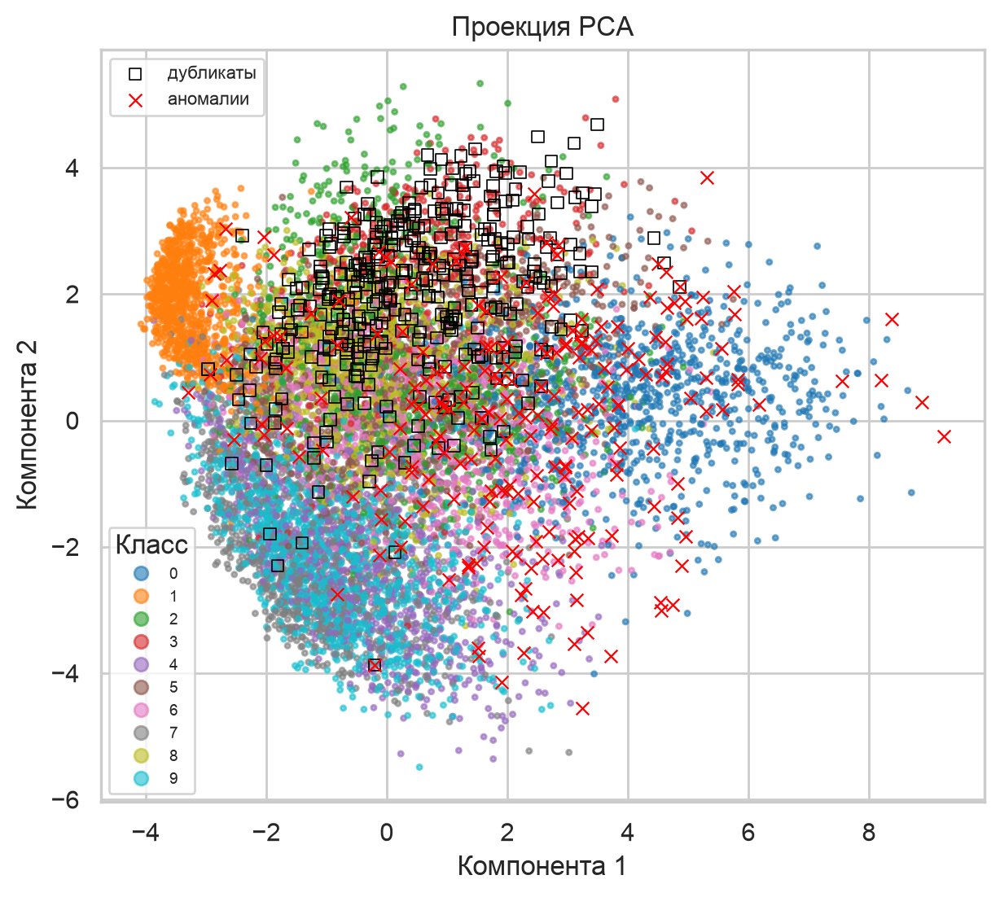

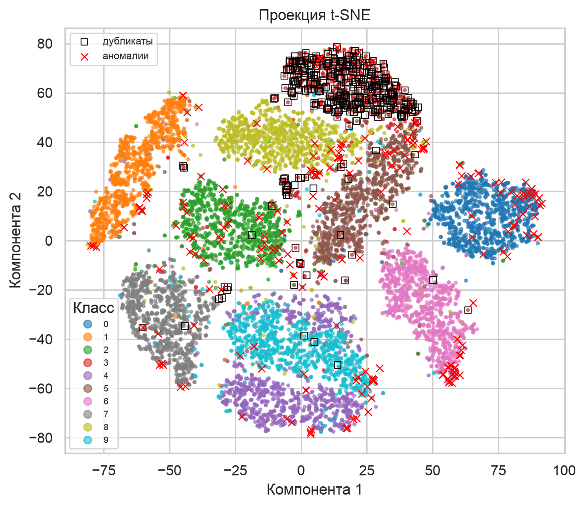

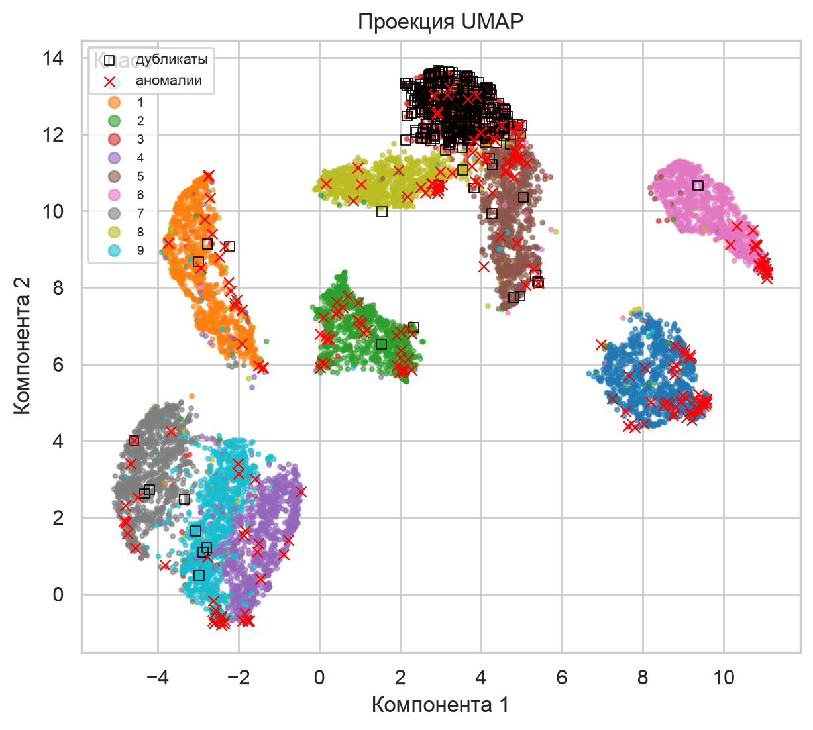

## Оценка репрезентативности

**Количественная.** По формуле $n = t^2 p q / \Delta^2$ (t = 1,96, Δ = 0,05,
p — доля класса) вычислено необходимое число объектов для каждого класса и
сопоставлено с фактическим (таблица 4). Даже для самого малого класса 9
требуется всего ~51 объект, тогда как фактически их 2 083 — то есть по объёму
**все классы репрезентативны** с запасом.

Таблица 4 – Количественная репрезентативность по классам

| Класс | Доля | Требуется $n$ | Фактически | Достаточно |
|---|---:|---:|---:|:--:|
| 0 | 0,0987 | 137 | 5923 | да |
| 3 | 0,1666 | 213 | 9997 | да |
| 9 | 0,0347 | 51 | 2083 | да |

**Качественная.** Распределение классов далеко от равномерного (коэффициент
дисбаланса 4,80). Хотя объёма достаточно, дисбаланс и дубликаты класса 3 могут
смещать модель в сторону преобладающего класса и завышать оценки на нём —
поэтому необходимы балансировка и очистка.

**Вывод по репрезентативности.** Набор репрезентативен количественно (объёма
хватает для всех классов), но качественно проблематичен: сильный дисбаланс
(классы 3 и 9), значительная доля дубликатов в классе 3 и ~2,35 % аномальных
объектов. Утечки тестовой выборки в обучающую нет: пересечение по точным
дубликатам изображений test↔train равно **0**.

# Описание представления изображений и его недостатков

Изображение 28 × 28 разворачивается в вектор длины 784 (row-major):
пиксель (r, c) → позиция $i = 28r + c$. Преобразование обратимо и не теряет
яркостную информацию, но для **полносвязной** сети теряется пространственная
структура: соседство пикселей, локальность признаков и инвариантность к сдвигу
модель должна выучивать из данных. Перед подачей значения масштабируются в
[0, 1] (деление на 255), что важно для интерпретации знаков весов первого слоя
(Часть 3). Подробно — в `docs/representation.md`, ответ на вопрос № 1 — в
`docs/control_questions.md`.

# Методики балансировки и фильтрации аномалий

Из обучающего набора сначала выделяется валидационная выборка (стратифицированное
разбиение 90/10, фиксированный seed), балансировка и очистка применяются **только
к обучающей части**, валидация остаётся исходной (чтобы отбор модели шёл по
реалистичному распределению). Строятся три варианта обучающего набора:

- **original** — обучающая часть без изменений (54 000 объектов);
- **balanced** — undersampling каждого класса до размера наименьшего класса
  (1 875 объектов на класс, всего 18 750);
- **cleaned** — сначала удаляются дубликаты и аномалии, затем undersampling
  (1 839 объектов на класс, всего 18 390).

Undersampling выбран потому, что класс 9 (после разбиения ~1 875 объектов) —
узкое место, а oversampling дублировал бы и без того малочисленный класс.
Аномалии не отбрасываются безвозвратно, а сохраняются для Части 3. Сравнение
распределений и размеров наборов — на рисунках 10 и 11.

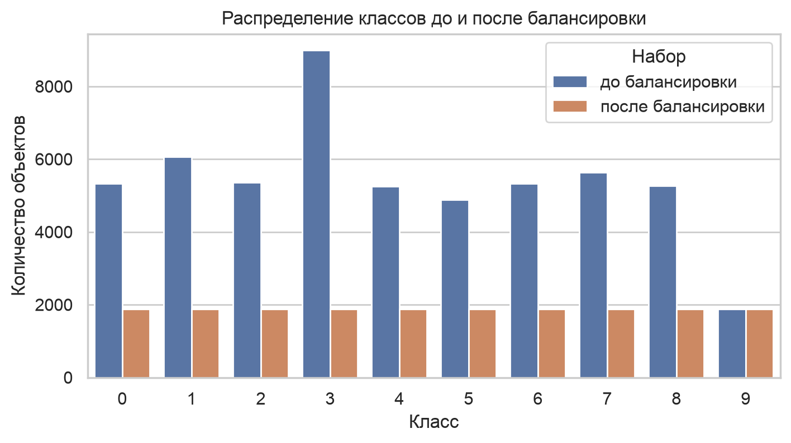

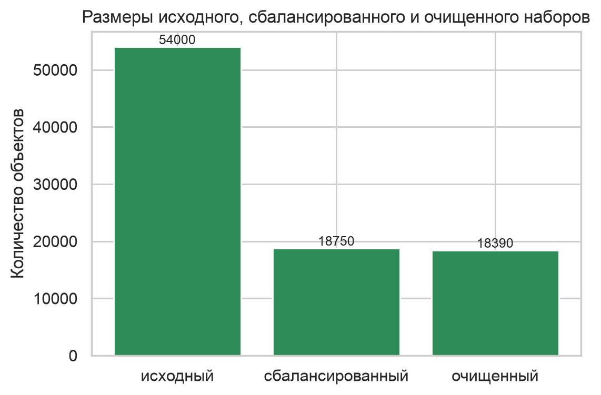

# Описание архитектуры и параметров обучения

*Раздел будет дополнен на этапе обучения модели (Часть 2).*

# Результаты обучения экземпляров модели с разными dropout и функциями активации

*Раздел будет дополнен на этапе обучения модели (Часть 2).*

# Количественное сравнение моделей

*Раздел будет дополнен на этапе обучения модели (Часть 2).*

# Качественный анализ предсказаний и аномальных объектов

*Раздел будет дополнен на этапе интерпретации (Часть 3).*

# Тепловые карты чувствительности (окклюзия 1×1, 2×2, 3×3)

*Раздел будет дополнен на этапе интерпретации (Часть 3).*

# Карты весов и активаций нейронов первого слоя

*Раздел будет дополнен на этапе интерпретации (Часть 3).*

# Сравнительный анализ PyTorch и JAX, дополнительный метод анализа

*Раздел будет дополнен на этапе дополнительного задания (Часть 4).*

# Итоговая сводка и выводы

*Раздел будет дополнен после завершения всех частей.*

# Список литературы

1. Попов И. Ю., Бучаев А. Я., Есипов Д. А. Валидация систем искусственного
   интеллекта: Лабораторный практикум. — СПб: Университет ИТМО, 2024. — 36 с.
2. ГОСТ 7.32–2017. Отчёт о научно-исследовательской работе. Структура и правила
   оформления.
3. LeCun Y., Cortes C., Burges C. The MNIST database of handwritten digits.
